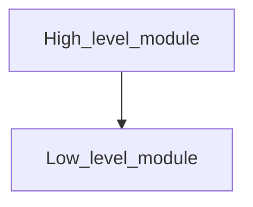
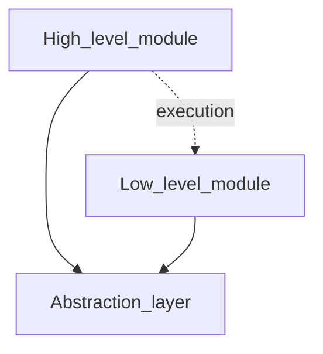

High-level modules should not depend on lower-level modules, both should depend on abstractions. Abstractions should not depend on details. Details should depend on abstractions. 

Dependency Inversion principle helps us to build Cohesive but loosely coupled application. The lower level should implement the abstraction which higher one injects. So the high level will interact with low level in the execution.






## Example
Imagine we have a system that sends notifications (emails, SMS, etc.). Instead of having the high-level `NotificationService` class depend directly on specific implementations (like `EmailService` or `SmsService`), we will define an abstraction (interface) that both the `NotificationService` and concrete services will depend on.

#### Step 1: Define the abstraction
```cs
public interface INotification
{
    void Send(string message);
}
```

#### Step 2: Implement the concrete classes
```cs
public class EmailNotification : INotification
{
    public void Send(string message)
    {
        Console.WriteLine($"Email sent with message: {message}");
    }
}

public class SmsNotification : INotification
{
    public void Send(string message)
    {
        Console.WriteLine($"SMS sent with message: {message}");
    }
}
```

#### Step 3: High-level module depending on the abstraction
```cs
public class NotificationService
{
    private readonly INotification _notification;

    // DIP is applied here: The service depends on an abstraction (INotification)
    public NotificationService(INotification notification)
    {
        _notification = notification;
    }

    public void Notify(string message)
    {
        _notification.Send(message);
    }
}
```

#### Step 4: Client Code (Composition Root)
Here’s how you would wire up the system, using dependency injection or manually passing the concrete implementation:
```cs
class Program
{
    static void Main(string[] args)
    {
        // Dependency Inversion applied: High-level module NotificationService depends on an abstraction (INotification)
        INotification emailNotification = new EmailNotification();
        NotificationService notificationService = new NotificationService(emailNotification);
        
        notificationService.Notify("Hello, this is a test notification via Email.");
        
        // Switch to another implementation like SMS
        INotification smsNotification = new SmsNotification();
        NotificationService smsService = new NotificationService(smsNotification);
        
        smsService.Notify("Hello, this is a test notification via SMS.");
    }
}
```

### Conclusion:
- **Abstraction (`INotification`)**: Both `NotificationService` and concrete implementations (`EmailNotification`, `SmsNotification`) depend on this abstraction. The service doesn’t need to know the details of how the notifications are sent, thus following the DIP.
- **Concrete implementations (`EmailNotification`, `SmsNotification`)**: These classes implement the `INotification` interface, so they can be substituted without modifying the high-level module.

This setup makes the code easier to maintain and test because new types of notifications (e.g., push notifications) can be added by creating new classes without changing the core logic of `NotificationService`.


